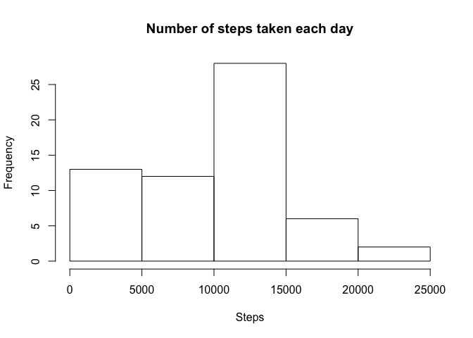

# Reproducible Research: Peer Assessment 1


## Loading and preprocessing the data


```r
rm(list=ls())
unzip("activity.zip")
dat <- read.csv("activity.csv",header=T)
```

## What is mean total number of steps taken per day?


```r
# Calculate total number of steps taken each day
count <- tapply(dat$steps,dat$date,sum,na.rm=T)
# Histogram of total steps taken each day
hist(count)
```

 

```r
#Mean number of steps taken
mean(count)
```

```
## [1] 9354.23
```

```r
#Median number of steps taken
median(count)
```

```
## [1] 10395
```

## What is the average daily activity pattern?


```r
Steps <- tapply(dat$steps,dat$interval,mean,na.rm=T)
Interval <- dat$interval[1:288]
plot(Interval,Steps,xlab="Interval (minutes)",type="l")
```

 

```r
Interval[which(Steps==max(Steps))]
```

```
## [1] 835
```
The inverval which contains the greatest steps is the 835 minutes interval. 


## Imputing missing values

Here I replace missing data with the average step count for that interval (calculated based on instances of the interval for which data are present).

```r
newsteps <- dat$steps
missdat <- which(is.na(dat$steps))
for(i in 1:length(missdat)){
	newsteps[missdat[i]] <- Steps[which(Interval==dat$interval[missdat[i]])]
}
# Histogram of steps taken per day with missing data replaced
count <- tapply(newsteps,dat$date,sum)
hist(count)
```

 

```r
# Mean step count with added data
mean(count)
```

```
## [1] 10766.19
```

```r
# Median step count with added data
median(count)
```

```
## [1] 10766.19
```
When mean interval values are added in the mean and median change (they increase), and the histogram of step count looks much more symmetrical.

## Are there differences in activity patterns between weekdays and weekends?


```r
# Create new dayking variable that distinguishes weekdays from weekends
day <- weekdays(as.POSIXct(dat$date))
daykind <- rep("weekday",length(day))
daykind[c(which(day=="Saturday"),which(day=="Sunday"))] <- "weekend"
#Calculate mean step count for each interval for weekdays and weekends
weekday <- tapply(newsteps[which(daykind=="weekday")],dat$interval[which(daykind=="weekday")],mean)
weekend <- tapply(newsteps[which(daykind=="weekend")],dat$interval[which(daykind=="weekend")],mean)
par(mfrow=c(1,2))
plot(Interval,weekday,type="l",xlab="Interval (minutes)",ylab="Steps",main="Weekdays",ylim=c(0,250))
plot(Interval,weekend,type="l",xlab="Interval (minutes)",ylab="Steps",main="Weekends",ylim=c(0,250))
```

 

```r
mean(weekday)
```

```
## [1] 35.61058
```

```r
mean(weekend)
```

```
## [1] 42.3664
```
Step activity appears to be more spread out on weekends, and in general there appears to be more activity on them as well.
